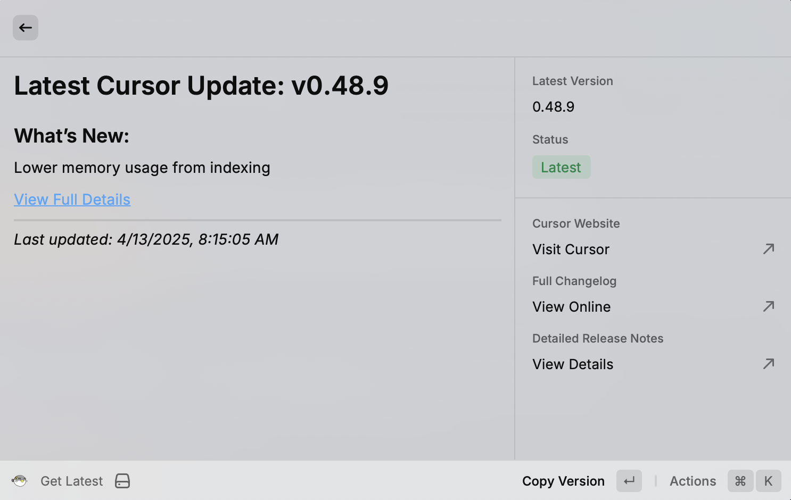
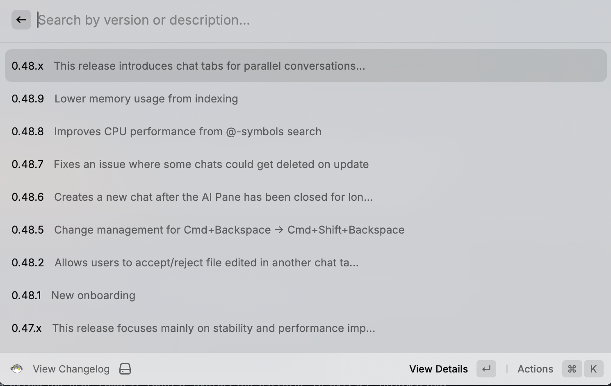

# Cursor Changelog Raycast Extension

A comprehensive solution for tracking and displaying Cursor editor updates, consisting of:

1. A scraper to extract changelog data
2. A Raycast extension to display the changelog

|  |  |
|--------------------------------------------------------|----------------------------------------------------------|

## Project Components

### 1. Data Extraction Tools

- `extract.py`: Python script to scrape and process changelog data from the Cursor website
- `data.py`: Helper utilities for the Python extraction process
- `cursor_changelog.txt`: Raw changelog content extracted from the website
- `changelog_patches.csv`: Processed changelog entries in CSV format

### 2. Raycast Extension

Located in the `/raycast-extention` directory, this extension provides a clean interface for viewing Cursor changelog entries through Raycast.

See the [Raycast Extension README](raycast-extention/README.md) for detailed information about the extension implementation.

## How It Works

1. **Data Extraction**:
   - The Python scripts scrape the Cursor changelog website
   - Raw content is processed into structured data
   - The data is formatted for consumption by the Raycast extension

2. **Raycast Extension**:
   - Uses Firecrawl to perform its own scraping of the changelog
   - Processes raw changelog content with regular expressions
   - Presents clean, searchable entries to the user
   - Provides detailed views for each version update

## Key Features

- **Version tracking**: Keep up with the latest Cursor editor releases
- **Search functionality**: Find specific features or fixes across versions
- **Version consolidation**: Group consecutive versions with identical descriptions
- **Detail links**: Access more comprehensive documentation for major releases

## Getting Started

### Prerequisites

- Python 3.7+ (for the extraction tools)
- Raycast (for the extension)
- Firecrawl API key (for the extension's web scraping)

### Installation

1. **Clone the repository**:
   ```bash
   git clone https://github.com/yourusername/cursor-changelog.git
   cd cursor-changelog
   ```

2. **Set up the Python environment** (optional, for extraction tools):
   ```bash
   python3 -m venv venv
   source venv/bin/activate  # On Windows: venv\Scripts\activate
   pip install -r requirements.txt
   ```

3. **Install the Raycast extension**:
   - Open Raycast
   - Go to Extensions
   - Click the "+" button and select "Add Extension"
   - Choose "Add from Source"
   - Select the `raycast-extention` directory from this repository

4. **Configure the extension**:
   - Add your Firecrawl API key in the extension preferences


## Technical Implementation


### Implementation Details

Detailed implementation notes are available in:
- [Implementation Documentation](raycast-extention/implementation.md): Technical details about the extension's implementation
- [Extension README](raycast-extention/README.md): User-facing documentation for the Raycast extension


### Architecture

The extension follows a modular architecture:

```
raycast-extention/
├── src/
│   ├── utils/
│   │   └── changelog.ts  # Core data processing logic
│   ├── view-changelog.tsx   # Main changelog browsing UI
│   ├── get-latest.tsx       # Latest version display
│   └── update-changelog.tsx # Update functionality
└── package.json             # Extension configuration
```

### Key Components

1. **Data Fetching & Processing** (`changelog.ts`):
   - Web scraping using [Firecrawl](https://firecrawl.dev) to extract Markdown content
   - Regular expression-based parsing to extract version numbers, descriptions, and links
   - Consolidation of consecutive versions into ranges (e.g., "0.46.1-0.46.5")
   - Local storage of processed changelog data

2. **Changelog Viewer** (`view-changelog.tsx`):
   - List-based UI with version numbers and truncated descriptions
   - Search functionality for filtering entries
   - Detailed view with full descriptions and external links

3. **Latest Version View** (`get-latest.tsx`):
   - Quick access to the most recent specific version
   - Metadata display with version, status, and links

4. **Update Mechanism** (`update-changelog.tsx`):
   - On-demand updating of changelog data
   - Progress reporting and error handling

### Core Functionality

#### Changelog Entry Definition

```typescript
interface ChangelogEntry {
  version: string;
  description: string;
  detailLink?: string;
}
```

#### Web Scraping & Content Extraction

```typescript
// Scrape and process the changelog
export const updateChangelog = async (apiKey: string): Promise<ChangelogEntry[]> => {
  try {
    ensureDataDir();
    
    const app = new FirecrawlApp({ apiKey });
    
    console.log("Scraping changelog...");
    const response = await app.scrapeUrl("https://www.cursor.com/changelog");
    
    // Extract markdown content
    const markdownContent = anyResponse.markdown ?? "";
    
    // Process content with regex patterns...
    // ...
    
    return changelog;
  } catch (error) {
    console.error(`An error occurred during scraping or processing: ${error}`);
    throw error;
  }
};
```

#### Detail Link Extraction

```typescript
// Extract detail link from a section if present
const extractDetailLink = (content: string): string | undefined => {
  // Look for ## [Title](link) pattern commonly used in the changelog
  const linkMatch = content.match(/##\s*\[([^\]]+)\]\(([^)]+)\)/);
  if (linkMatch && linkMatch[2]) {
    return linkMatch[2];
  }
  return undefined;
};
```

#### Version Consolidation Logic

The extension intelligently groups consecutive version numbers that share the same description:

```typescript
// Group consecutive versions
const ranges: string[][] = [];
let currentRange = [validVersions[0]];

for (let i = 1; i < validVersions.length; i++) {
  const prevParts = versionParts(validVersions[i-1]);
  const currParts = versionParts(validVersions[i]);
  
  // Check if versions are consecutive
  if (prevParts.length === 3 && currParts.length === 3 &&
      prevParts[0] === currParts[0] &&
      prevParts[1] === currParts[1] &&
      prevParts[2] + 1 === currParts[2]) {
    currentRange.push(validVersions[i]);
  } else {
    ranges.push(currentRange);
    currentRange = [validVersions[i]];
  }
}
```

#### Content Cleaning

The extension processes raw changelog content to create clean, consistent descriptions:

```typescript
// Clean up a description string
const cleanDescription = (desc: string): string => {
  desc = desc.trim();
  
  // Remove leading punctuation
  desc = desc.replace(/^[.,:;\-)\]]+\s*/, "");
  
  // Replace markdown links with just the text
  desc = desc.replace(/\[([^\]]+)\]\([^)]+\)/g, "$1");
  
  // Remove URLs  
  desc = desc.replace(/https?:\/\/\S+/g, "");
  
  // Additional cleaning...
  // ...
  
  return desc.trim();
};
```

### UI Implementation

#### Changelog List View

```tsx
<List
  isLoading={isLoading}
  searchBarPlaceholder="Search by version or description"
  onSearchTextChange={setSearchText}
  throttle
>
  {filteredEntries.map((entry) => (
    <List.Item
      key={entry.version}
      title={entry.version}
      subtitle={entry.description.length > 60 ? 
        `${entry.description.substring(0, 60)}...` : 
        entry.description}
      actions={
        <ActionPanel>
          <Action.Push
            title="View Details"
            icon={Icon.Eye}
            target={<ChangelogDetail 
              version={entry.version} 
              description={entry.description} 
              detailLink={entry.detailLink} 
            />}
          />
          {/* Additional actions */}
        </ActionPanel>
      }
    />
  ))}
</List>
```

#### Detail View with External Links

```tsx
function ChangelogDetail({ version, description, detailLink }) {
  const markdown = `# Cursor ${version}\n\n${description}${detailLink ? 
    `\n\n[View Full Details](${detailLink})` : ''}`;
  
  return (
    <Detail
      markdown={markdown}
      actions={
        <ActionPanel>
          {/* Copy actions */}
          {detailLink && (
            <Action.OpenInBrowser
              title="Open Detailed Changelog"
              url={detailLink}
              shortcut={{ modifiers: ["cmd"], key: "o" }}
            />
          )}
        </ActionPanel>
      }
    />
  );
}
```
