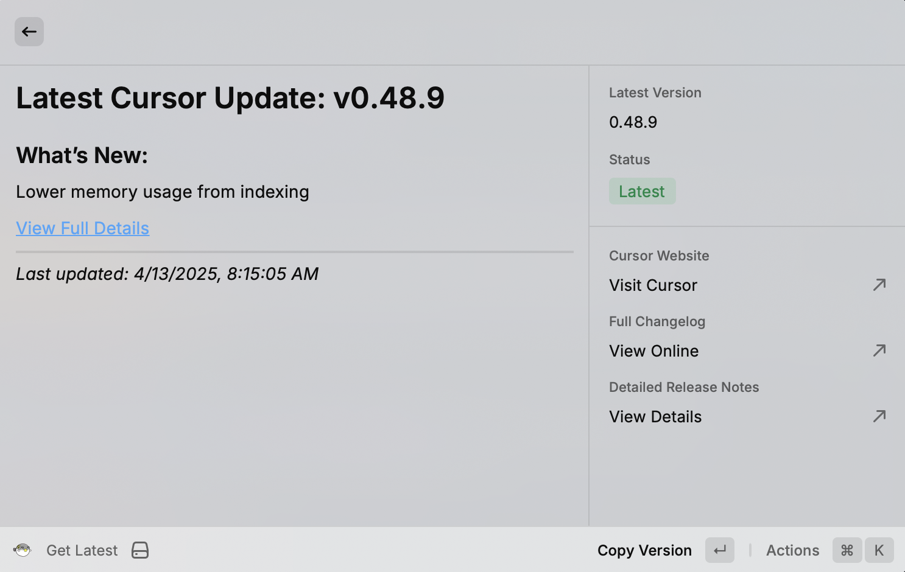
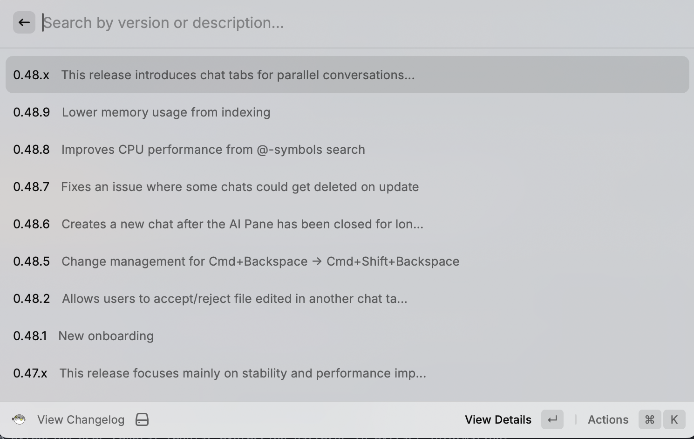

# Cursor Changelog Extension for Raycast

A Raycast extension to view and track updates to the Cursor editor.

The extension fetches, parses, and displays the Cursor editor changelog, allowing users to stay updated with the latest features and releases.

## Overview

This extension uses firecrawl scraping to extract structured data from the [Cursor changelog website](https://www.cursor.com/changelog), processes it into a searchable format, and presents it to users through a clean Raycast interface.

|  |  |
|--------------------------------------------------------|----------------------------------------------------------|

## Features

- **View Changelog**: Browse through all Cursor changelog entries with version filtering and full-text search capabilities
- **Get Latest**: Quickly access the most recent Cursor update with detailed info
- **Update Changelog**: Fetch and process the latest changelog data from the Cursor website
- **Detailed Entry View**: View comprehensive details for each changelog entry
- **External Links**: Open specific release detail pages in your browser
- **Version Range Consolidation**: Intelligently groups consecutive version numbers with the same description

## Setup Requirements

1. Install the extension
2. Sign up for a [Firecrawl](https://firecrawl.dev) account and obtain an API key
3. Add your Firecrawl API key in the extension preferences

## Commands

### View Changelog

Browse through all Cursor changelog entries. You can search by version number or description text. Select an entry to view its full details.

### Update Changelog

Fetch the latest changelog data from the Cursor website. This command updates the local database of changelog entries.

### Get Latest

Quickly see the most recent Cursor update with its full description.


## Development Notes

### Regular Expression Patterns

The extension uses several regular expression patterns to extract information:

- **Individual patches**: `/(\d+\.\d+\.\d+)\s*:?\s*-?\s*([^-:0-9][^0-9]*?)(?=\s*-\s*\d+\.\d+\.\d+|\n|$)/g`
- **Major versions**: `/(?:^|\n)(\d+\.\d+\.x)[\s\S]*?(?=\n\d+\.\d+\.x|\n\d{3,4}|\Z)/g`
- **Detail links**: `/##\s*\[([^\]]+)\]\(([^)]+)\)/`

### State Management

The extension uses React's `useState` and `useEffect` hooks for state management:

```tsx
const [entries, setEntries] = useState<ChangelogEntry[]>([]);
const [isLoading, setIsLoading] = useState(true);
const [searchText, setSearchText] = useState("");

useEffect(() => {
  async function fetchChangelog() {
    try {
      const data = loadChangelog();
      setEntries(data);
    } catch (error) {
      // Error handling
    } finally {
      setIsLoading(false);
    }
  }
  
  fetchChangelog();
}, []);
```

## Known Limitations and Future Improvements

- Depends on the current structure of the Cursor changelog website
- Could implement a scheduled background update mechanism
- Potential for additional features like changelog diffing between versions

## Credits

This extension is not affiliated with Cursor or Anthropic. It fetches publicly available information from the Cursor website. 